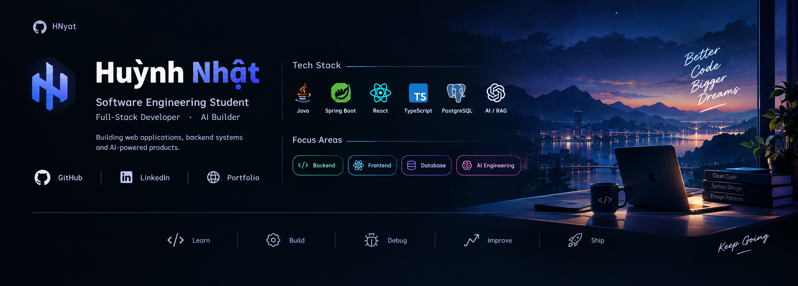

<div align="center">



<br/>

# Hi, I'm Huỳnh Nhật 👋

### Full-Stack Developer · Software Engineering Student · AI Builder

I build **web applications, backend systems, and AI-powered products** —  
from designing the architecture to writing the code, integrating AI, and shipping the product.

<br/>

[](https://github.com/HNyat)

</div>

---

## 👨‍💻 About Me

I'm a Software Engineering student who enjoys turning ideas into **real, usable products**.

My main focus is **Full-Stack Development**, with a strong interest in **Backend Engineering, System Design, and AI-powered applications**. I like working across the entire development process — building interfaces, designing APIs, modeling databases, integrating services, and deploying applications.

I'm currently exploring how **AI can be combined with modern software engineering** through LLM applications, RAG, AI Agents, and intelligent developer tools.

```text
Build → Break → Understand → Improve → Ship
```

> I don't just want to make things work.  
> I want to understand **why they work**.

---

## 🛠️ Tech Stack

| Category             | Technologies                                                                                                            |
| :------------------- | :---------------------------------------------------------------------------------------------------------------------- |
| **Languages**        |                                        |
| **Backend**          |                                    |
| **Frontend**         |                               |
| **Database**         |                                    |
| **DevOps & Tools**   |                    |
| **AI & Engineering** | `LLM` · `RAG` · `AI Agents` · `AI APIs` · `REST API` · `Authentication` · `Testing` · `System Design` · `Microservices` |

---

## 🚀 What I Build

| Area                   | What I work on                                             |
| ---------------------- | ---------------------------------------------------------- |
| 🌐 **Full-Stack**      | Modern web applications, dashboards and product interfaces |
| ⚙️ **Backend**         | REST APIs, authentication, business logic and data systems |
| 🗄️ **Database**        | Relational & NoSQL data modeling and optimization          |
| 🤖 **AI Applications** | LLM, RAG, embeddings, vector search and AI agents          |
| 🏗️ **Engineering**     | System design, microservices, testing and deployment       |

---

## 📊 GitHub Stats

<div align="center">


</div>

<br/>

<div align="center">


</div>

---

## 📈 Contribution Activity

<div align="center">


</div>

---

## 🤝 Let's Connect

<div align="center">

I'm interested in **Full-Stack Development, Backend Engineering, AI, developer tools, and technology products.**

<br/>

[GitHub](https://github.com/HNyat) · [LinkedIn](https://www.linkedin.com/in/hu%E1%BB%B3nh-nh%E1%BA%ADt-a2860b323/) · [Portfolio](YOUR_PORTFOLIO)

<br/><br/>

**Build something interesting.**

</div>
